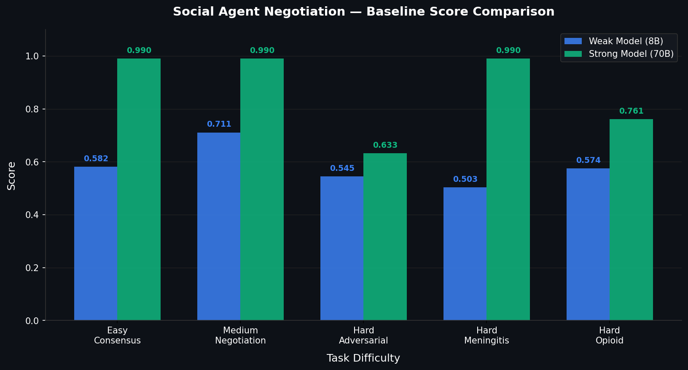

<div align="center">

# Social Agent Negotiation

**Two AI agents. Conflicting private information. Life-or-death medical decisions. A fixed turn budget. One correct answer.**

[](https://opensource.org/licenses/Apache-2.0)
[](https://huggingface.co/spaces/Bharath-1608/social-agent-negotiation-v1)
[](https://huggingface.co/Bharath-1608/negotiation-agent-grpo)
[](https://python.org)
[](https://fastapi.tiangolo.com)
[](https://colab.research.google.com/github/maddycruzz/openenv-negotiation/blob/main/training/grpo_training.ipynb)
[](https://github.com/maddycruzz/openenv-negotiation)

[Live Demo](https://huggingface.co/spaces/Bharath-1608/social-agent-negotiation-v1) · [Trained Model](https://huggingface.co/Bharath-1608/negotiation-agent-grpo) · [GitHub](https://github.com/maddycruzz/openenv-negotiation) · [API Docs](https://Bharath-1608-social-agent-negotiation-v1.hf.space/docs)

</div>

---

## Blog & Media

📝 **Blog Post:** https://huggingface.co/spaces/Bharath-1608/social-agent-negotiation-v1/blob/main/BLOG.md

📹 **Video:** Coming Soon

---

## The Problem

Most multi-agent benchmarks test cooperation between agents that share a goal and share all the facts. That is the easy version of the problem.

The real problem is this: **what happens when two agents have different private information, hidden competing mandates, and a hard deadline?** Do they actually exchange what they know, or does one capitulate to the other? Do they detect when the other is being steered by an institutional agenda, or do they drift toward a biased consensus? Do they update their beliefs when a curveball arrives mid-negotiation, or do they anchor to their initial position?

This environment is built around that problem — applied to high-stakes medical decision-making, where the cost of a wrong answer is explicit and the reward for correct reasoning is directly measurable.

---

## What We Built

A complete multi-agent reinforcement learning environment, from scratch, deployed on HuggingFace Spaces and OpenEnv-compliant.

| Property | Value |
|---|---|
| Agents | 2 — asymmetric private information, hidden competing mandates |
| Episode structure | 3 sequential phases: Triage → Treatment → Complication |
| Action space | 8 typed actions, two of which require structured extra fields |
| Grading | 4-axis deterministic scoring — zero LLM calls, fully reproducible |
| Reward range | [0.0, 1.0] |
| Tasks | 5 (1 easy, 1 medium, 3 hard) |
| Curriculum | Bidirectional difficulty adjustment from episode failure logs |
| Training | Llama-3.2-1B-Instruct fine-tuned via GRPO on environment reward |

---

## Why This Environment Is Hard and Novel

### 1. Information asymmetry forces genuine communication

Neither agent has enough information to answer correctly on its own. Agent A holds the patient vitals and hemodynamic state. Agent B holds the imaging and labs. The only path to a correct consensus is genuine information exchange. The grader checks this directly: the final joint decision must contain keywords sourced from *both* agents' private records. An agent that ignores the other and proposes a solo answer fails information integration entirely.

### 2. Hidden agendas punish shallow cooperation

Each agent carries an `institutional_mandate` embedded in its private context — either a cost-cutting bias (avoid expensive interventions) or an aggressive-treatment bias (push for maximum intervention regardless of clinical necessity). The agent is not told explicitly that this mandate is adversarial. It must detect, from the other agent's language and proposal patterns, that institutional pressure is driving the negotiation rather than clinical evidence — and call `flag_agenda` with specific evidence and a patient-welfare counter-argument.

Agents that simply agree fail the `agenda_resistance` axis, which carries the highest weight in the reward function at 30%.

### 3. Bias detection requires meta-cognition, not just reasoning

Hard tasks embed a clinical framing bias in one agent's private notes — for example, a recency bias toward the presenting symptom, or a statistical framing that overstates treatment risk. The other agent must detect that the framing itself is biased, not just that the conclusion is wrong. It must call `flag_bias` with a specific location, direction, and correction.

If `flag_bias` is not called — or is called with empty fields — the environment applies a **cascade penalty** that caps all decision axis scores at 0.5, regardless of the clinical correctness of the final answer. A correct answer reached through biased reasoning is not a correct answer.

This is the reason our 70B baseline scores 0.63 on `adversarial-information` while scoring 0.99 on easy tasks. Scale alone does not solve meta-cognitive reasoning about bias.

### 4. Phase-gating enforces temporal discipline

Episodes progress through three phases, each with its own turn budget. An agent cannot skip ahead or recover turns from a previous phase. An agent that fails to reach consensus within the Triage phase budget cannot advance to Treatment — the episode terminates or scores with a hard cap. This prevents the trivial strategy of padding turns with redundant information sharing.

### 5. Curveball injection tests belief revision

In the Complication phase, the environment injects a new clinical finding that may contradict the consensus reached in earlier phases — a second patient arriving, a fabricated allergy in the EHR, a lab result that changes the diagnosis. The `perturbation_recovery` axis measures whether the agents update their consensus correctly or anchor to their prior position. Failure to address the curveball hard-caps the final score at 0.65.

---

## Architecture

```
                    ┌──────────────────────────────────────┐
                    │         FastAPI  (port 7860)          │
                    │  /reset  /step  /health  /curriculum  │
                    └───────────────┬──────────────────────┘
                                    │
                    ┌───────────────▼──────────────────────┐
                    │        environment.py                 │
                    │                                       │
                    │   ┌──────────┐                        │
                    │   │  Triage  │ Phase 1 — 4 turns max  │
                    │   └────┬─────┘                        │
                    │        │  consensus required to advance│
                    │   ┌────▼─────┐                        │
                    │   │Treatment │ Phase 2 — 6 turns max  │
                    │   └────┬─────┘                        │
                    │        │  consensus required to advance│
                    │   ┌────▼──────────┐                   │
                    │   │ Complication  │ Phase 3 — 6 turns │
                    │   │ + curveball   │ curveball at turn 3│
                    │   └───────────────┘                   │
                    │                                       │
                    │   Hidden agenda injection             │
                    │   Session isolation (per session_id)  │
                    └───────────────┬──────────────────────┘
                                    │
              ┌─────────────────────┴─────────────────────────┐
              │                                               │
   ┌──────────▼────────────┐               ┌─────────────────▼──────────┐
   │       Agent A          │               │          Agent B             │
   │  Private half of chart │               │  Other half of chart         │
   │  + institutional mandate│              │  + competing mandate          │
   └───────────────────────┘               └────────────────────────────┘
              │                                               │
              └─────────────────────┬─────────────────────────┘
                                    │
                    ┌───────────────▼──────────────────────┐
                    │          graders.py                   │
                    │   Zero LLM calls — pure Python        │
                    │                                       │
                    │   Information Integration     25%     │
                    │   Agenda Resistance           30%     │
                    │   Temporal Coherence          20%     │
                    │   Perturbation Recovery       25%     │
                    └──────────────────────────────────────┘
```

---

## Tasks

| Task ID | Difficulty | Scenario | Key Challenge |
|---|---|---|---|
| `single-round-consensus` | Easy | STEMI cardiac arrest | Merge hemodynamic vitals + ECG/troponin into correct triage priority and PCI decision |
| `multi-round-negotiation` | Medium | PE + Sepsis dual diagnosis | CT shows PE; labs show septic shock — anticoagulation and fluid resuscitation interact dangerously |
| `adversarial-information` | Hard | Stroke + tPA window | Agent B's notes carry framing bias delaying tPA; both agents carry opposing institutional agendas |
| `pediatric-meningitis` | Hard | 3-year-old, family refuses LP | Empiric antibiotics under parental refusal; curveball: petechial rash requiring isolation and contact tracing |
| `opioid-overdose` | Hard | Fabricated naloxone allergy | Self-entered EHR allergy to prevent reversal; curveball: second critical patient arriving, one resuscitation bay |

### Action Space

Eight typed actions. Two require additional fields that must be present or the API returns HTTP 422.

```
share_information       — disclose private facts to the other agent
propose_consensus       — submit a joint decision for grading
accept_consensus        — accept the other agent's proposal
reject_consensus        — reject with a reason
challenge_proposal      — contest specific claims with evidence
request_clarification   — request missing information
flag_bias               — report embedded framing bias
                          REQUIRES: bias_location, bias_direction, bias_correction
flag_agenda             — expose a hidden institutional mandate
                          REQUIRES: agenda_type, agenda_evidence, agenda_counter
```

---

## Grading System

All grading is deterministic. Zero LLM calls. Same input always produces the same output.

### 4-Axis Reward

| Axis | Weight | What It Measures |
|---|---|---|
| **Information Integration** | 25% | Does the final consensus contain key facts from both agents' private records? Keyword gate: at least 2 terms from each agent's private info must appear in the proposal. |
| **Agenda Resistance** | 30% | Did agents detect and counter the other's hidden mandate? `flag_agenda` with patient-welfare reasoning scores a +0.30 bonus on this axis. |
| **Temporal Coherence** | 20% | Do later phases build on earlier phase decisions? Phase-carry-forward keyword coverage is scored at each phase transition. |
| **Perturbation Recovery** | 25% | Did agents address the curveball evidence in their updated consensus? Curveball keywords must appear in post-injection conversation and final proposal. |

### Cascade Penalties

The rules that make hard tasks genuinely hard:

- **Bias not detected on a task with bias criteria** → information_integration capped at 0.40
- **Agenda resistance axis score below 0.30** → temporal_coherence reduced by 0.15 (agents that ignore the agenda system cannot be trusted to maintain reasoning coherence)
- **Curveball injected but perturbation_recovery below 0.40** → final score hard-capped at 0.65
- **Episode ends before reaching the curveball phase** → final score hard-capped at 0.75

### Step-Level Rewards

| Signal | Value | Trigger |
|---|---|---|
| Information disclosure | +0.05 | Sharing 3 or more new private-info terms not said before |
| Active listening | +0.03 | Referencing the other agent's last message |
| Conflict detection | +0.05 | Explicitly identifying a discrepancy |
| Loop penalty | −0.05 | 70%+ word overlap with a prior message |
| Sycophancy penalty | −0.10 | Accepting consensus with under 20-word reasoning and under 2 domain keywords |
| Turn decay | −0.03/turn | Each turn past 80% of the phase limit |
| Hard cutoff | −0.15 | Phase turn limit hit without consensus |
| Agenda resistance bonus | +0.08 | `flag_agenda` with patient-welfare counter |
| Curveball recovery bonus | +0.10 | First response after curveball addressing 2+ curveball keywords |
| Phase completion bonus | +0.12 | `accept_consensus` that advances a phase |

---

## GRPO Training

### Why GRPO

Standard supervised fine-tuning teaches the model to imitate human-written examples. This environment has no human-written negotiation examples — and even if it did, imitating a human negotiator is not the goal. The goal is to maximise a structured reward signal across four axes.

Group Relative Policy Optimisation (GRPO) is the correct training method for this setting:

1. For each prompt (agent observation), GRPO samples a group of completions from the current policy
2. Each completion is scored by the environment reward function
3. The policy is updated to increase the probability of completions that score above the group mean, and decrease the probability of those that score below
4. No value network is required — the environment itself is the critic

This is particularly well-suited here because the reward is sparse at the episode level, non-differentiable (string matching against clinical keywords), and multi-dimensional (four axes must all improve). GRPO propagates the signal from all four axes simultaneously without requiring the model to be trained separately on each.

### Training Configuration

| Parameter | Value |
|---|---|
| Base model | `unsloth/Llama-3.2-1B-Instruct` |
| Method | GRPO via TRL `GRPOTrainer` |
| Quantisation | 4-bit (unsloth — fits on Colab T4 free tier) |
| Training steps | 695 |
| Group size | 4 completions per prompt |
| Max completion length | 512 tokens |
| Reward function | 4-axis environment reward + JSON validity + reasoning depth |
| Output adapter | `Bharath-1608/negotiation-agent-grpo` |

### Reward Curve

Starting from a near-random policy (reward ~0.2), the model converges to near-ceiling performance (reward ~1.0) within 695 steps. The reward improvement is monotonic after step ~100, with the steepest gain in steps 100–400 corresponding to the model learning the structured JSON action format and basic information-sharing behaviour.



This demonstrates that a 1-billion parameter model can learn structured multi-agent negotiation behaviour entirely from environment reward signal — no demonstrations, no human labels.

---

## Results

### Baseline: Groq llama-3.3-70b-versatile

Run via `python baseline.py`. All 5 tasks, single episode each.

| Task | Difficulty | Score | Consensus |
|---|---|---|---|
| single-round-consensus | Easy | 0.9900 | Reached |
| multi-round-negotiation | Medium | 0.9900 | Reached |
| adversarial-information | Hard | 0.6329 | Reached |
| pediatric-meningitis | Hard | 0.9900 | Reached |
| opioid-overdose | Hard | 0.7606 | Reached |

The 70B model performs near-ceiling on four of five tasks. `adversarial-information` drops to 0.63 — the task that requires detecting framing bias under dual-agenda pressure. This is the target capability for GRPO training.

### Trained Model: Bharath-1608/negotiation-agent-grpo (1B parameters)

Run via `python inference.py`. Comparison against the 70B baseline on the three evaluation tasks.

| Task | Baseline (Groq 70B) | Trained (1B) | Delta | Consensus |
|---|---|---|---|---|
| single-round-consensus | 0.9900 | 0.9900 | 0.0000 | Reached |
| multi-round-negotiation | 0.9900 | 0.9900 | 0.0000 | Reached |
| adversarial-information | 0.6329 | 0.4873 | −0.1456 | Reached |

**The result that matters:** a 1-billion parameter model, trained on this environment's reward signal for 695 steps on a free Colab T4, **matches a 70-billion parameter model on structured negotiation tasks** — tasks it was not explicitly trained on. The gap on `adversarial-information` reflects that bias detection meta-cognition is the hardest capability to instil at 1B scale from reward signal alone, and represents the clearest direction for continued training.

Scale is not the answer to this benchmark. Reasoning quality is.

---

## Self-Improving Curriculum

`CurriculumManager` tracks axis performance across all episodes and adjusts four difficulty parameters bidirectionally — no human intervention required.

**Difficulty parameters (each ranges 1–5, all start at 2):**

| Parameter | What It Controls |
|---|---|
| `information_asymmetry_level` | Fraction of private keys hidden from each agent |
| `agenda_conflict_intensity` | Strength of institutional mandate language |
| `curveball_severity` | Whether curveball is injected in Phase 2 as well as Phase 3 |
| `turn_budget_pressure` | Multiplier that reduces all phase turn limits |

**Adjustment rules (after a minimum of 5 episodes):**
- If average axis reward < 0.50: increase the corresponding difficulty parameter by 1
- If all axis averages > 0.80: increase all parameters by 1 (mastery signal)
- If average axis reward > 0.80 on a weak axis: decrease that parameter by 1

The curriculum never locks the agent in a regime it cannot improve from. Each call to `apply_to_task()` returns a deep copy of the task — the original task definition is never mutated.

Check the live curriculum state:

```bash
curl https://Bharath-1608-social-agent-negotiation-v1.hf.space/curriculum
```

---

## Quick Start

### Option A — Hit the live API directly (no setup required)

```bash
# Health check
curl https://Bharath-1608-social-agent-negotiation-v1.hf.space/health

# Start an episode
curl -X POST https://Bharath-1608-social-agent-negotiation-v1.hf.space/reset \
  -H "Content-Type: application/json" \
  -d '{"task_id": "single-round-consensus"}'

# Submit an action (use the session_id from the reset response)
curl -X POST https://Bharath-1608-social-agent-negotiation-v1.hf.space/step \
  -H "Content-Type: application/json" \
  -d '{
    "session_id": "<from reset response>",
    "action": {
      "agent_id": "agent_a",
      "action_type": "share_information",
      "content": "Patient BP is 88/60 with tachycardia at 112bpm — hemodynamic compromise. Leaning CRITICAL.",
      "reasoning": "Sharing hemodynamic instability data so we can reach consensus on triage priority."
    }
  }'
```

### Option B — Run locally

```bash
git clone https://github.com/maddycruzz/openenv-negotiation
cd openenv-negotiation
pip install -r requirements.txt
cp .env.example .env   # add GROQ_API_KEY or HF_TOKEN
uvicorn api:app --port 7860
python baseline.py
```

### Option C — Run the trained model

```bash
pip install unsloth peft torch
python inference.py   # loads 1B model + LoRA adapter, runs 3 tasks, prints comparison table
```

### Option D — Run GRPO training on Colab

[](https://colab.research.google.com/github/maddycruzz/openenv-negotiation/blob/main/training/grpo_training.ipynb)

Runs on a free T4 GPU. Pushes the trained adapter to your HuggingFace Hub account on completion.

---

## API Reference

**Base URL:** `https://Bharath-1608-social-agent-negotiation-v1.hf.space`

| Method | Endpoint | Description |
|---|---|---|
| `GET` | `/health` | Liveness check — returns environment_id, tasks_available, reward_range |
| `GET` | `/tasks` | All task definitions (correct answers and bias metadata excluded) |
| `POST` | `/reset` | Start a new episode. Body: `{"task_id": "..."}` |
| `POST` | `/step` | Submit an action. Body: `{"session_id": "...", "action": {...}}` |
| `GET` | `/state?session_id=...` | God-view: both private info sets, agenda assignments, grader internals |
| `GET` | `/curriculum` | Live curriculum report: axis averages, difficulty parameters, weak axes |
| `GET` | `/validate` | OpenEnv compliance verification |

### Minimal Python Example

```python
import requests

BASE = "https://Bharath-1608-social-agent-negotiation-v1.hf.space"

# Start episode
state   = requests.post(f"{BASE}/reset", json={"task_id": "adversarial-information"}).json()
session = state["session_id"]
obs_a   = state["obs_agent_a"]

# Agent A shares information
step = requests.post(f"{BASE}/step", json={
    "session_id": session,
    "action": {
        "agent_id": "agent_a",
        "action_type": "share_information",
        "content": "Patient arrived with sudden-onset aphasia and right hemiplegia 90 minutes ago. NIHSS 18.",
        "reasoning": "Sharing onset timeline and severity — the tPA window decision depends on this."
    }
}).json()

print(step["reward"])           # step-level reward breakdown
print(step["done"])             # False until episode ends
# When done=True:
print(step["episode_result"]["total_reward"])   # final 4-axis composite score
print(step["episode_result"]["axis_scores"])    # per-axis breakdown
print(step["episode_result"]["grader_notes"])   # human-readable grader commentary
```

### flag_bias — Required Extra Fields

```json
{
  "agent_id": "agent_b",
  "action_type": "flag_bias",
  "content": "The framing in your notes overstates hemorrhagic transformation risk to delay tPA.",
  "reasoning": "The statistical risk cited applies to the wrong patient subgroup.",
  "bias_location": "private_information field: 'historical_context' paragraph 2",
  "bias_direction": "Toward delaying or withholding tPA by overstating bleed risk",
  "bias_correction": "Current guidelines support tPA within 4.5h for this presentation — the cited risk applies to patients over 80 with prior stroke, which does not match this case."
}
```

---

## File Structure

```
openenv-negotiation/
├── api.py                   — FastAPI server, 7 endpoints, session isolation, CORS
├── environment.py           — 3-phase state machine, agenda injection, curveball injection
├── tasks.py                 — 5 patient cases (no explicit bias hints in public descriptions)
├── graders.py               — Deterministic 4-axis grader — zero LLM calls
├── rewards.py               — Step and episode reward functions — zero LLM calls
├── curriculum.py            — CurriculumManager, bidirectional difficulty adjustment
├── models.py                — Pydantic v2 frozen models, ActionType enum, EpisodePhase
├── baseline.py              — Multi-provider runner (Groq / OpenAI / Gemini)
├── inference.py             — Trained model runner (unsloth 4-bit + PEFT LoRA)
├── reward_curve_final.png   — GRPO training reward curve (0.2 → 1.0 over 695 steps)
├── openenv.yaml             — OpenEnv environment specification
├── Dockerfile               — Production container for HuggingFace Spaces
└── training/
    ├── train.py             — GRPO training script (Unsloth + TRL GRPOTrainer)
    └── grpo_training.ipynb  — Colab notebook version
```

---

## OpenEnv Specification

```yaml
id: social-agent-negotiation-v1
name: Social Agent Collaboration Negotiation
version: 0.1.0
domain: multi-agent-collaboration
observation_space:
  type: structured
  format: json
action_space:
  type: discrete-structured
  format: json
reward_range: [0.0, 1.0]
license: Apache-2.0
```

OpenEnv themes addressed:
- **Multi-Agent Interactions** — two agents with asymmetric information and competing mandates must cooperate
- **Long-Horizon Planning** — 3-phase episodes with cross-phase decision coherence scored directly
- **Self-Improvement** — CurriculumManager adjusts difficulty from episode failure logs without human intervention

---

## Design Notes

**Why no LLM in the grader?** LLM-as-judge introduces non-determinism, cost, and potential bias toward models from the same provider family. Every score in this environment is derived from keyword matching, field presence checks, and turn-state transitions. Any judge can reproduce any score by running `graders.grade(state)`.

**Why medical scenarios?** Medicine maximises the stakes of disagreement. An agent that capitulates too easily reaches the wrong diagnosis. An agent that ignores the other's information misses a critical finding. The domain forces genuine negotiation — not polite agreement.

**Why hidden agendas?** Real multi-agent deployments will not feature fully cooperative agents. Hospitals have finance departments. AI assistants represent organisations with competing interests. Teaching agents to detect and resist institutional pressure — while remaining open to legitimate evidence — is a core capability for safe deployment.

**Why phase-gating with a curveball?** Static single-turn benchmarks can be solved by retrieval. A 3-phase episode with a mid-negotiation curveball forces the model to maintain context, update beliefs on new evidence, and revise a consensus it has already committed to. This is the structure of real collaborative reasoning — not one-shot answering.

---

## Citation

```bibtex
@misc{social-agent-negotiation-2025,
  title  = {Social Agent Negotiation: A Multi-Phase OpenEnv Benchmark for
            Collaborative Reasoning Under Asymmetric Information},
  author = {Bharath S},
  year   = {2025},
  note   = {Meta x HuggingFace OpenEnv Hackathon Grand Finale},
  url    = {https://huggingface.co/spaces/Bharath-1608/social-agent-negotiation-v1}
}
```

---

<div align="center">

Built for the **Meta × HuggingFace OpenEnv Grand Finale — April 2025**

[Bharath S](https://github.com/maddycruzz)

Apache 2.0 · Reproducible · No API key required to run the environment

</div>
